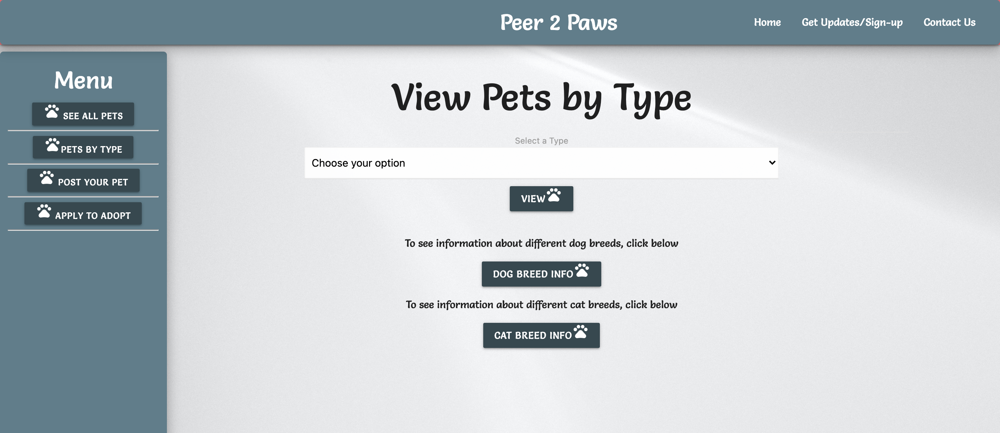
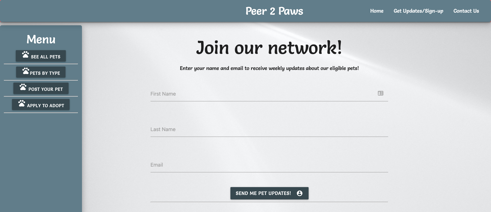

# Peer-2-Paws

---

This application utilizes multiple front and back-end packages including handlebars, sequelize, & vue.js to render a peer-2-peer pet adoption site. The site allows users to create a new pet entry when a pet is up for adoption and allows potential adopters to search for pets, register for updates, apply to adopt a pet, and research cat and dog breed information.

---

## Requirements

GIVEN a pet adoption site \
WHEN a user searches for pets \
THEN the user is able to view all pets up for adoption \
THEN the user can apply to adopt a pet \
THEN the user can also apply for updates \
AND the user can search for breed information to determine if the pet is a good fit \

## Links

* [Peer-2-Paws Application](https://peer-2-paws.herokuapp.com/)
* [Github Repository](https://github.com/JonDnv/Peer2Paws)
  
---

## Mock Up

The following images shows the finished site:

---

## Contributing Members

* [Jon Godwin](https://github.com/JonDnv)
* [Jon Keopangna](https://github.com/jkeopangna)
* [Gil Orcilla](https://github.com/gilorcilla)
* [Jules Wood](https://github.com/Juliannewood2413y)

---

## Contributing Technologies

* [handlebars](https://handlebarsjs.com/)
* [node.js](https://nodejs.org/en/)
* [npm](https://www.npmjs.com/)
* [Sequelize ORM](https://sequelize.org/)
* [Vue.js](https://vuejs.org/)

---

## Change History

 1. Created Shell html, js, css & README files
 2. Created GitHub Pages site
 3. Created SQL schema & seed data
 4. Created handelbars layouts & partials
 5. Created Apply, Contact, Index, See-All, Specific Type pages
 6. Created API & HTML routes
 7. Created Cat & Dog Breed Info pages
